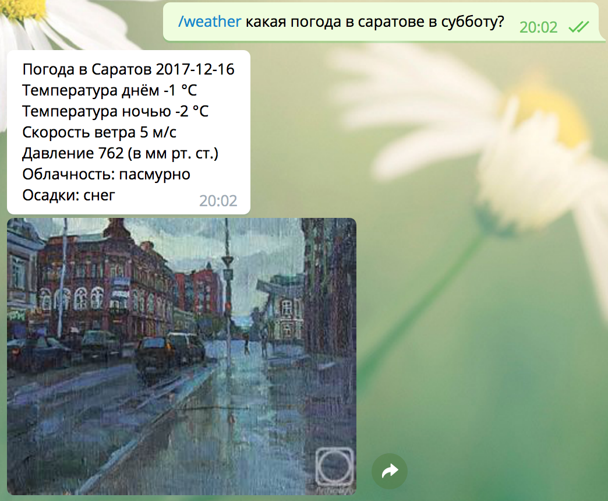

**Smart Weather Bot**

Telegram бот, который умеет отвечать на запросы про погоду.
****

Что он может?

* Отвечать на простые запросы "Город, дата":

* Принимать дату в формате dd.mm:

* Вычленять более сложные запросы:
    
    ___
    
    ___
    

* Обрабатывать некоторые ошибки ввода:
    
    ___
    
    ___
    
    ___
    
    
* Есть /help
    

****
Какие API использованы?
1) pyTelegramBotAPI
1) Яндекс.Погода
2) Поиск по картинкам от Bing
3) pymorphy2 для нормализации слов

****

